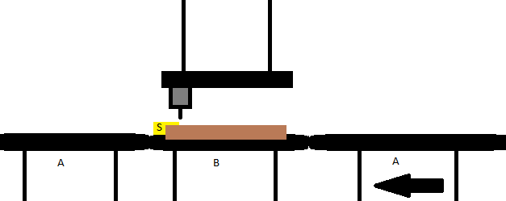

# SuperEffectiveBohrMachine

## Info

TwinCAT 3 SPS, Motion, C++, HMI

## Beschreibung

Die einzeln, manuell betreibbare Bohrmaschine wird in diesem Projekt in eine Maschinenanlage integriert.

Das Rollentransportsystem (A) läuft kontinuierlich. Werkstücke werden in geeignetem Abstand und Geschwindigkeit transportiert. Das Rollensystem der Bohrmaschine (B) läuft solange synchron mit (A), bis der Sensor (S) ein anliegendes Werkstück erfasst. Wurde ein Werkstück erfasst, stoppt das Transportsystem (B). Das Werkstück wird durch die Bohrmaschine bearbeitet. Nach der Bearbeitung beschleunigt das Transportsystem (B) und transportiert das Werkstück über (A) ab.

(Eventuelle Fixiervorrichtungen, welche das Werkstück während des Bohrens fixieren, sollen in diesem Beispiel zunächst vernachlässigt werden)

## Technische Umsetzung

### Komponenten

* Bohrmaschine (SPS)
* TransportA (SPS)
* TransportB (SPS)
* Sensor (SPS)
* Controller (C++)
* Userinterface (HMI)  
  

### Beschreibung

Der Controller steuert das grundlegende Verhalten der Anlage. Er regelt das Zusammenspiel der Bohrmaschine, der Transportsysteme und des Sensors. Über das Userinterface kann die Anlage gestartet, gestoppt und überwacht werden.
